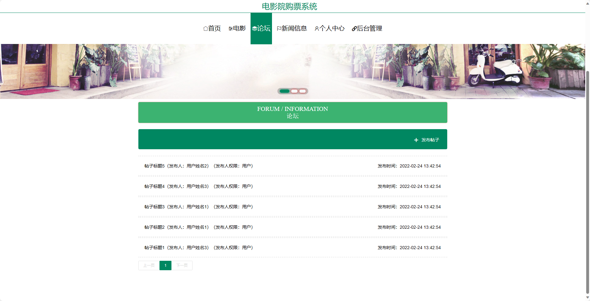
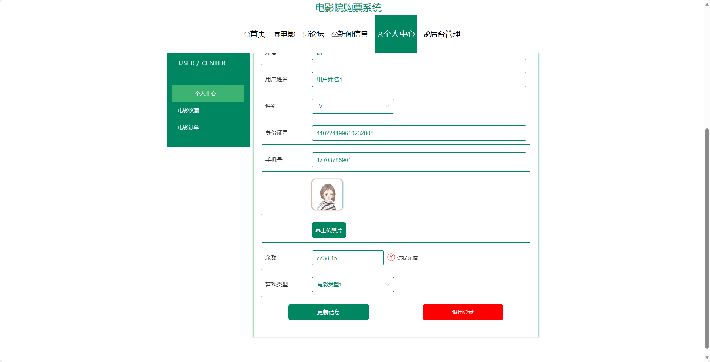
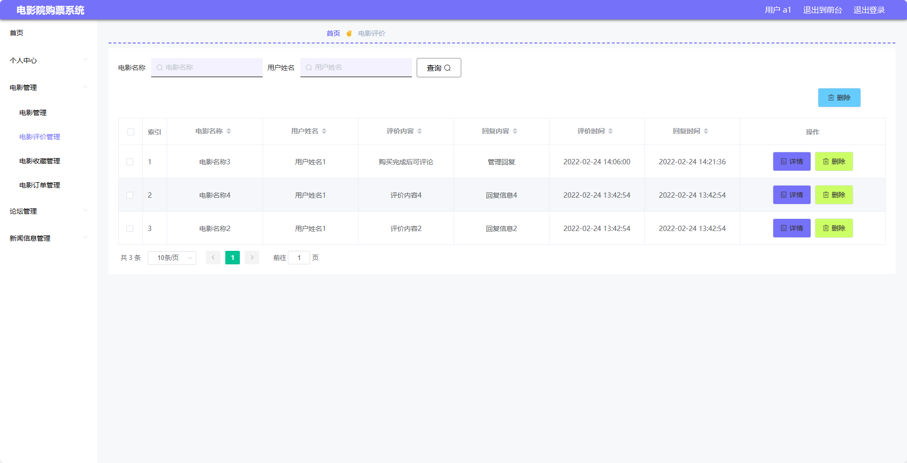
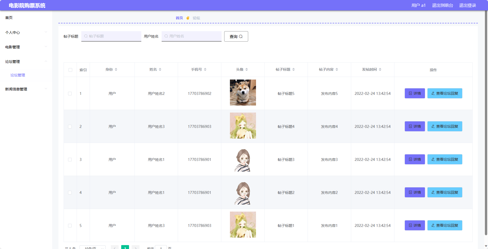
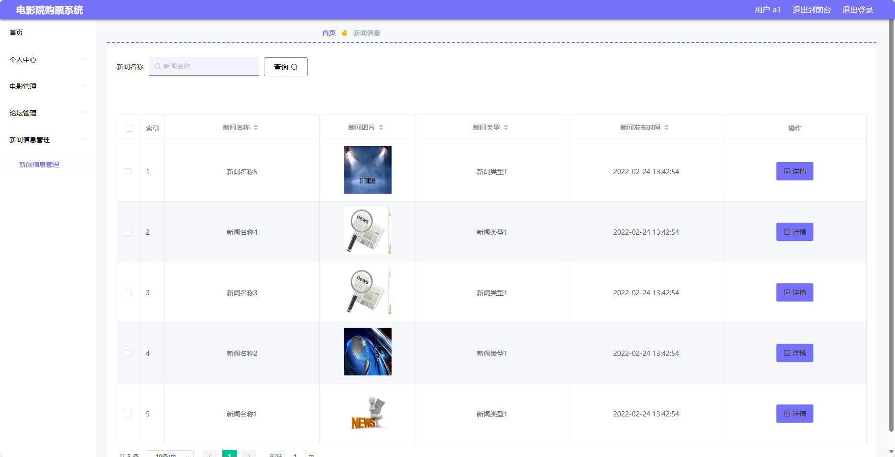
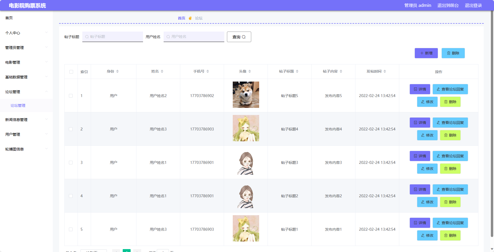

## 基于SpringBoot的电影院购票系统(程序+报告)

###  获取sql数据库文件: 从戎源码网 (https://armycodes.com/) QQ: 386869957 QQ群: 377586148
###  所有系统地址: (https://github.com/YuLin-Coder/AllProjectCatalog) 
###  所有项目以及源代码本人均调试运行无问题 可支持远程安装部署调试、定制修改、代码讲解

## 项目介绍
基于SpringBoot的电影院购票系统，系统包含两种角色：管理员、用户,系统分为前台和后台两大模块，主要功能如下。

### 【管理员】:
- 个人中心：管理个人信息。
- 管理员管理：管理其他管理员的账号信息。
- 电影管理：管理电影信息，包括添加、编辑、删除电影。
- 基础数据管理：管理系统的基础数据，如电影类型、演员信息等。
- 论坛管理：管理论坛信息，包括帖子审核、删除等操作。
- 新闻信息管理：管理新闻信息，包括添加、编辑、删除新闻。
- 用户管理：管理用户信息，包括查看、冻结、删除用户账号。
- 轮播图信息：管理首页轮播图的展示信息。

### 【用户】:
- 个人中心：管理个人信息。
- 电影管理：管理电影信息，包括添加、编辑、删除电影。
- 论坛管理：管理论坛信息，包括帖子审核、删除等操作。
- 新闻信息管理：管理新闻信息，包括添加、编辑、删除新闻。

### 【前台】:
- 首页：展示系统概要信息。
- 电影：浏览电影列表、查看电影详情。
- 论坛：参与电影讨论的社区。
- 新闻信息：浏览电影相关的新闻资讯。
- 个人中心：管理个人信息。

## 项目技术
- 编程语言：Java
- 数据库：MySQL
- 项目管理工具：Maven
- 前端技术：HTML、CSS、JavaScript、Jquery、Vue
- 后端技术：Spring、SpringMVC、MyBatis

## 运行环境
- JDK版本：JDK1.8及以上
- 开发工具：IDEA、Ecplise、Myecplise都可以
- 数据库: MySQL5.7及以上
- Maven：maven3.0及以上
- Node：14.14.0及以上

## 运行截图

